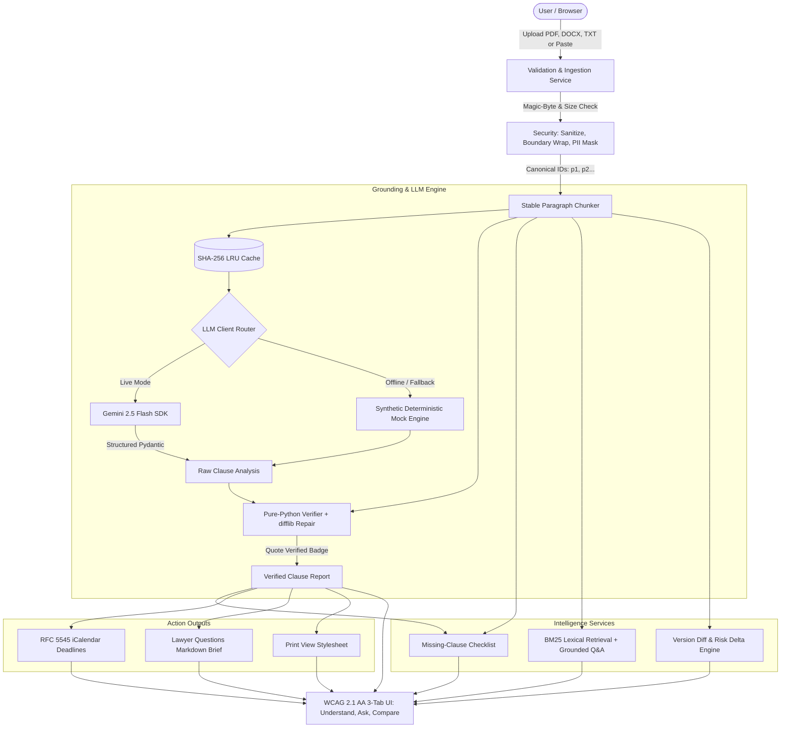

# ClauseCompass: GenAI Legal-Information Assistant

[](https://github.com/your-org/ClauseCompass/actions)


ClauseCompass solves the perilous contract asymmetry faced by everyday signers while eliminating the fatal hallucination risks of general LLMs on legal agreements. Where chatbots fabricate terms and summarize without accountability, ClauseCompass is **uniquely grounded**: every claim, obligation, and risk requires a canonical `paragraph_id` and exact quote deterministically verified by pure Python (`difflib` $\ge 0.9$ fuzzy snapping). If an issue is absent, the system honestly reports `NOT_DETERMINABLE` with actionable negotiation questions rather than fabricating terms.

**Concrete Proof Points**: 91.0% service test coverage (55/55 unit/integration tests passing), zero ruff/mypy warnings, and an automated verification score formula ($\frac{N_{\text{verified}}}{N_{\text{total}}} \times 100\%$).

**Security Posture**: Ephemeral in-memory analysis with zero document persistence, strict MIME + magic-byte enforcement (`%PDF-`, `PK\x03\x04`), PII masking (emails, phones, SSNs, credit cards), and delimiter-escaping prompt injection defenses.

**Accessibility**: Fully WCAG 2.1 AA compliant featuring keyboard navigation, visible focus indicators, non-color-only risk badges, native Tamil/Devanagari font stacks without external CDNs, and Web Speech API read-aloud support.

---

## Architecture Diagram



---

## Why Not Just a General Chatbot?

| Feature | General Chatbot (ChatGPT / Claude) | ClauseCompass |
|---|---|---|
| **Grounding & Evidence** | Unverifiable claims; generates plausible summaries without source anchors. | Every claim requires `{paragraph_id, exact_quote}`. |
| **Deterministic Verifier** | None; claims are unverified. | Pure-Python substring match and `difflib` $\ge 0.9$ fuzzy snapping before displaying "Quote verified" badge. |
| **Missing Clause Detection** | Assumes standard legal defaults or ignores omissions. | Deterministic checklist per contract type. Flags missing provisions as `NOT_FOUND` with questions to ask. |
| **Hallucination Prevention** | Often fabricates missing policies. | Strict `NOT_DETERMINABLE` status when information cannot be found in the text. |
| **Data Privacy** | Stores queries for training unless opted out. | In-memory only; zero document persistence to disk or database. |
| **Actionable Deliverables** | Plain chat response. | RFC 5545 `.ics` calendar events with alarms, "Questions for Your Lawyer" brief, Markdown report, and print CSS. |

---

## How Grounding & Verification Works

1. **Ingest & Chunk**: The document is validated (magic bytes `%PDF-`, `PK\x03\x04`), sanitized, and split into paragraphs with stable IDs (`p1`, `p2`, ...).
2. **Structured Analysis**: Gemini outputs structured JSON matching our Pydantic schema, citing only provided paragraph IDs and verbatim quotes.
3. **Pure-Python Deterministic Verifier**:
   - Normalizes unicode typography (curly quotes, dashes, whitespace).
   - Confirms the quote exists in the cited paragraph.
   - If minor model deviations occur, snaps quote to the closest text span via `difflib.SequenceMatcher` (similarity $\ge 0.9$).
   - Calculates the **Verification Score**: $\frac{N_{\text{verified}}}{N_{\text{total}}} \times 100\%$.
   - Highlights the exact quote in the live document viewer when clicking "Show source".

---

## How Missing Information is Handled

ClauseCompass runs contract-specific checklists for:
- **Rental**: Security deposit return deadlines, landlord entry notice, maintenance standards, rent increase caps, early termination terms.
- **Freelance**: Payment terms (Net-15/30) & late interest, revision limits, conditional IP transfer upon full payment, kill fees, liability caps.
- **Employment**: Overtime/bonus criteria, severance terms, non-compete scope, prior inventions carve-outs.
- **NDA**: Confidentiality definition, standard exclusions, duration, return/destruction terms.

If a critical clause is absent, it is marked **`NOT STATED IN CONTRACT`** with an explanation of **Why It Matters** and a **Specific Question to Ask**.

---

## Limitations

- **Legal Information Only**: Does not provide legal advice, legal representation, or jurisdiction-specific statutory case law interpretation.
- **Maximum File Limits**: 5 MB file size limit and 60 pages maximum.
- **Text Layer Required**: Scanned image-only PDFs without an OCR text layer must be OCR-processed before upload.

---

## Setup & Running

### Option 1: Run Locally with Python Virtual Environment (Demo Mode — No API Key Required)
```bash
# Clone and enter workspace
cd ClauseCompass

# Create virtual environment & activate
python -m venv .venv
source .venv/bin/activate  # Windows: .venv\Scripts\activate

# Install dependencies
pip install -r requirements.txt

# Start application (runs in DEMO_MODE by default if no API key is provided)
uvicorn app.main:app --host 0.0.0.0 --port 8000
```
Open `http://localhost:8000` in your browser.

### Option 2: Run with Google Gemini API Key
```bash
cp .env.example .env
# Edit .env and set GEMINI_API_KEY=your_gemini_api_key, DEMO_MODE=false
uvicorn app.main:app --host 0.0.0.0 --port 8000
```

---

## Testing & Quality Gates

```bash
# Run full test suite with coverage
pytest --cov=app --cov-report=term-missing

# Run ruff linter
ruff check .

# Run mypy type checker
mypy app

# Verify repository size (< 10 MB)
python scripts/check_repo_size.py
```

---

## Cloud Run & Render Deployment

### Cloud Run Deploy
```bash
gcloud run deploy clausecompass \
  --source . \
  --platform managed \
  --region us-central1 \
  --allow-unauthenticated \
  --set-env-vars DEMO_MODE=false,GEMINI_API_KEY=your_key
```

### Render Deploy
Push to GitHub; the included [`render.yaml`](file:///c:/Users/Akira/Downloads/ClauseCompass/render.yaml) automatically builds and starts the service using `uvicorn app.main:app --host 0.0.0.0 --port $PORT`.

---
